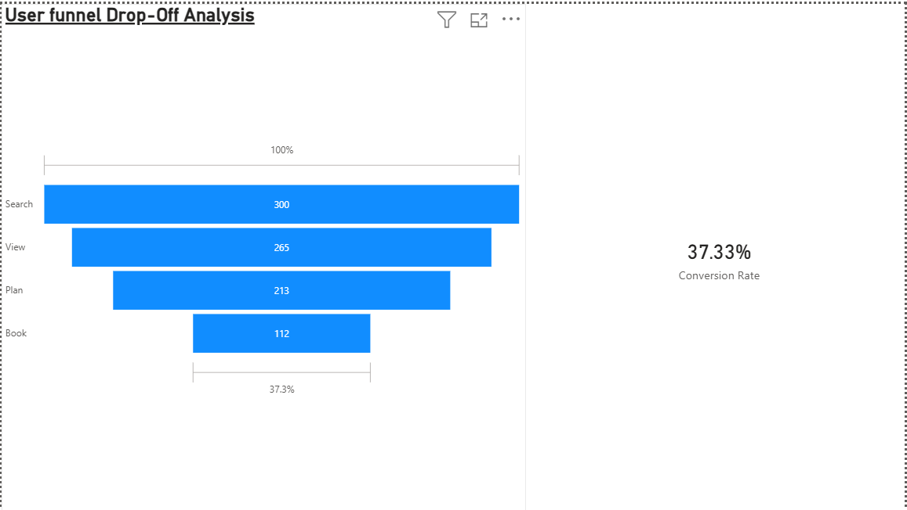
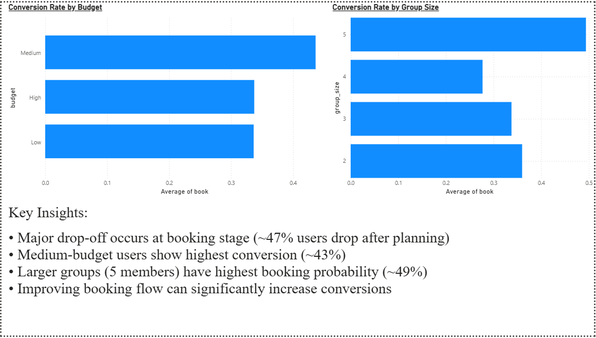

# User Funnel & Conversion Analysis

This project analyzes user behavior in a travel booking flow:
Search → View → Plan → Book

## Dashboard

### Funnel Analysis

### Conversion by Budget and GroupSize

## Features
- Funnel conversion analysis
- Drop-off identification
- Segmentation by budget and group size

## Key Insights
- Major drop-off occurs at booking stage
- Larger groups show lower conversion rates
- High-budget users convert more frequently

## Tools Used
Python, Pandas, Power BI